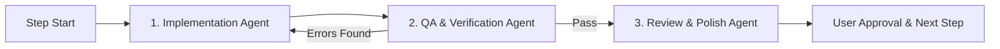

# 📱 Messefy Mobile: সম্পূর্ণ সাব-এজেন্ট ড্রিভেন ইমপ্লিমেন্টেশন প্ল্যান

> **লক্ষ্য:** বর্তমান Messefy Web (`Hono` ব্যাকএন্ড + `PostgreSQL` + `Next.js` ফিচারসমূহ)-এর সাথে পূর্ণাঙ্গ সামঞ্জস্য রেখে **Tauri 2.0 (Rust) + React 19 + TypeScript + Bun** ভিত্তিক একটি প্রিমিয়াম মোবাইল অ্যাপ্লিকেশন ধাপে ধাপে তৈরি করা।

---

## 🤖 সাব-এজেন্ট ড্রিভেন সিস্টেম আর্কিটেকচার (Execution Workflow)

প্রতিটি স্টেপ বাস্তবায়নের ক্ষেত্রে একটি **৩-ধাপবিশিষ্ট সাব-এজেন্ট চক্র (Sub-Agent Loop)** স্বয়ংক্রিয়ভাবে পরিচালিত হবে:



1. **ইমপ্লিমেন্টেশন সাব-এজেন্ট (Worker Agent):**
   - সংশ্লিষ্ট স্টেপের প্রয়োজনীয় টাইপস, এপিআই হুক্স ও UI কম্পোনেন্ট তৈরি করবে।
   - React 19, strict TypeScript, TanStack Query এবং shadcn মোবাইল প্যাটার্ন মেনে কোড লিখবে।
2. **ভেরিফিকেশন সাব-এজেন্ট (QA & Quality Agent):**
   - কোড লেখার পর স্বয়ংক্রিয়ভাবে চালাবে:
     - `bun x tsc --noEmit` (টাইপ নির্ভুলতা নিশ্চিত করতে)
     - `bun run lint` (অক্সলিন্ট কোড স্ট্যান্ডার্ড রক্ষা করতে)
     - দরকারি ক্ষেত্রে টেস্ট বা রানটাইম রেন্ডার যাচাই।
3. **রিভিউ ও সাইন-অফ সাব-এজেন্ট (Review Agent):**
   - মোবাইল টাচ এক্সপেরিয়েন্স, ডার্ক মোড, নেটওয়ার্ক এরর হ্যান্ডলিং ও ফর্ম ভ্যালিডেশন (Zod) রিভিউ করবে।
   - সব মানদণ্ড সন্তোষজনক হলে উক্ত স্টেপটিকে `DONE` মার্ক করে পরবর্তী স্টেপের জন্য অনুমোদন দেবে।

---

## 🗺️ ধাপে ধাপে ইমপ্লিমেন্টেশন রোডম্যাপ (৮টি সুনির্দিষ্ট ফেজ)

```mermaid
gantt
    title Messefy Mobile Roadmap
    dateFormat  X
    axisFormat  Phase %s
    section Core & Auth
    Phase 1: API & Storage Setup       :active, p1, 0, 1
    Phase 2: Authentication Flow       :p2, 1, 2
    section Mess & Dashboard
    Phase 3: Workspace & Onboarding    :p3, 2, 3
    Phase 4: Live Dashboard & Summary  :p4, 3, 4
    section Daily & Finance
    Phase 5: Daily Meals & Meal Sheet  :p5, 4, 5
    Phase 6: Deposits & Expenses       :p6, 5, 6
    section Admin & Polish
    Phase 7: Members & Month Lifecycle :p7, 6, 7
    Phase 8: Offline, Cache & Release  :p8, 7, 8
```

---

### 🔹 ফেজ ১: মোবাইল কোর ইনফ্রাস্ট্রাকচার ও নেটওয়ার্ক ক্লায়েন্ট (Foundations)
* **উদ্দেশ্য:** ব্যাকএন্ডের সাথে নিরাপদ যোগাযোগের পাইপলাইন ও স্টোরেজ লেয়ার তৈরি।
* **মূল কাজসমূহ:**
  - `TanStack Query` (`@tanstack/react-query`) ও `Axios`/`Ky` ইন্সটল ও কনফিগারেশন।
  - সেন্ট্রালাইজড API ক্লায়েন্ট (`src/lib/api-client.ts`) তৈরি—যেখানে স্বয়ংক্রিয়ভাবে `Authorization: Bearer <token>` এবং বেস URL যুক্ত হবে।
  - টোকেন পারসিস্টেন্সের জন্য সুরক্ষিত স্টোরেজ মডিউল (`src/lib/auth-storage.ts`)।
  - গ্লোবাল এরর ও টোস্ট নোটিফিকেশন সিস্টেম (`sonner` বা কাস্টম মোবাইল ফ্রেন্ডলি টোস্ট)।
* **সাব-এজেন্ট ভেরিফিকেশন:**
  - ডামি এন্ডপয়েন্টে নেটওয়ার্ক রিকোয়েস্ট টেস্ট ও টাইপ-চেকিং।

---

### 🔹 ফেজ ২: অথেন্টিকেশন ও সেশন ম্যানেজমেন্ট (Authentication Flow)
* **উদ্দেশ্য:** ইউজার সাইন-ইন, সাইন-আপ এবং মোবাইল অ্যাপ খোলার সাথে সাথে অটোমেটিক লগইন চেক।
* **মূল কাজসমূহ:**
  - **লগইন স্ক্রিন (`SignInScreen`):** ইমেইল ও পাসওয়ার্ড ইনপুট, পাসওয়ার্ড শো/হাইড, রিমেম্বার মি।
  - **রেজিস্ট্রেশন স্ক্রিন (`SignUpScreen`):** নাম, ইমেইল, পাসওয়ার্ড ভ্যালিডেশন (Zod স্কিমা সহ)।
  - **অথ স্টেট ও গার্ড (`AuthContext` / `Zustand Auth Slice`):** টোকেন রিফ্রেশ ও সেশন ভ্যালিডিটি যাচাই।
  - ইউজার লগইন থাকলে সরাসরি ড্যাশবোর্ডে রিডাইরেক্ট, না থাকলে লগইন স্ক্রিনে নিয়ে যাওয়া।
* **সাব-এজেন্ট ভেরিফিকেশন:**
  - ব্যাকএন্ডের `/auth/signin` এবং `/auth/signup` রুটের সাথে লাইভ টেস্ট ও এরর মেসেজ হ্যান্ডলিং (ভুল পাসওয়ার্ড, ডুপ্লিকেট ইমেইল ইত্যাদি)।

---

### 🔹 ফেজ ৩: মেস নির্বাচন, তৈরি ও ইনভাইটেশন (Workspaces & Onboarding)
* **উদ্দেশ্য:** একজন ব্যবহারকারী যে মেসে আছেন তা সিলেক্ট করা বা নতুন মেস তৈরি/যুক্ত হওয়া।
* **মূল কাজসমূহ:**
  - ব্যবহারকারীর মেস তালিকা (`/workspaces`) আনা।
  - **মেস সিলেকশন শিট (Workspace Switcher):** একাধিক মেস থাকলে সহজেই সুইচ করা।
  - **নতুন মেস তৈরি ফর্ম (`CreateMessModal`):** মেসের নাম ও ঠিকানা দিয়ে তাৎক্ষণিক মেস খোলা।
  - **ইনভাইট কোড দিয়ে মেসে যুক্ত হওয়া (`JoinMessModal`):** ম্যানেজার থেকে পাওয়া কোড দিয়ে মেম্বার হিসেবে প্রবেশ।
  - কারেন্ট মেস আইডি গ্লোবাল কনটেক্সট বা লোকাল স্টোরেজে সেভ রাখা।
* **সাব-এজেন্ট ভেরিফিকেশন:**
  - কোনো মেসে যুক্ত না থাকা ইউজারের ক্ষেত্রে সঠিক "Join or Create" এম্পটি স্টেট প্রদর্শিত হচ্ছে কি না তা নিশ্চিত করা।

---

### 🔹 ফেজ ৪: লাইভ মেস ড্যাশবোর্ড ও চলতি মাসের হিসাব (Live Overview)
* **উদ্দেশ্য:** বর্তমানে আমরা যে স্ট্যাটিক হোমপেজ UI বানিয়েছি, সেটিকে ব্যাকএন্ডের আসল লাইভ ডাটার সাথে কানেক্ট করা।
* **মূল কাজসমূহ:**
  - `/periods/current` এবং `/summary` এন্ডপয়েন্ট থেকে লাইভ সামারি ডাটা ফেচ করা।
  - [PeriodSummaryCard](file:///c:/Users/IBRAHIM/KHALIL/Documents/Code-Zoo/messefy-web/mobile/src/components/home/PeriodSummaryCard.tsx)-এ লাইভ মিল রেট, মোট মিল ও মোট খরচ রেন্ডার করা।
  - [MyStatusCard](file:///c:/Users/IBRAHIM/KHALIL/Documents/Code-Zoo/messefy-web/mobile/src/components/home/MyStatusCard.tsx)-এ লগইন করা ব্যবহারকারীর নিজস্ব মিল সংখ্যা, জমা এবং ব্যালেন্স প্রদর্শন।
  - **Pull-to-refresh:** স্ক্রিন নিচে টেনে রিফ্রেশ করার নেটিভ মোবাইল জেসচার সাপোর্ট।
* **সাব-এজেন্ট ভেরিফিকেশন:**
  - স্কেলিটন লোডার (Skeleton loaders) এবং নেটওয়ার্ক অফলাইন হ্যান্ডলিং যাচাই।

---

### 🔹 ফেজ ৫: মিল ম্যানেজমেন্ট ও মিল শিট (Daily Meals & Meal Chart)
* **উদ্দেশ্য:** প্রতিদিনের মিল বাড়ানো-কমানো এবং মাসের পুরো মিল শিট দেখা।
* **মূল কাজসমূহ:**
  - **আজকের মিল কাউন্টার আপডেট:** দুপুর/রাতের মিল বাড়ালে বা অফ করলে সাথে সাথে `/meals/daily` API কল।
  - **ম্যানেজার মিল এন্ট্রি:** মেসের ম্যানেজারের জন্য সব মেম্বারের আজকের মিল একসাথে এন্ট্রি করার দ্রুত গ্রিড টেবিল।
  - **মাসিক মিল শিট স্ক্রিন (`MealChartScreen`):** ১ তারিখ থেকে শেষ তারিখ পর্যন্ত কার কত মিল পড়েছে তার স্ক্রলেবল ক্যালেন্ডার/ম্যাট্রিক্স ভিউ।
* **সাব-এজেন্ট ভেরিফিকেশন:**
  - অপটিমিস্টিক আপডেট (Optimistic UI Update) যাতে বাটনে চাপ দিলে মিলের সংখ্যা কোনো ল্যাগ ছাড়াই সাথে সাথে বাড়ে/কমে।

---

### 🔹 ফেজ ৬: ডিপোজিট ও বাজার খরচের হিসাব (Finances & Ledger)
* **উদ্দেশ্য:** টাকা জমা এবং মেসের যাবতীয় বাজার খরচ সংরক্ষণ ও ইতিহাস দেখা।
* **মূল কাজসমূহ:**
  - **টাকা জমা ফর্ম (`DepositEntryModal`):** মেম্বার সিলেক্ট, টাকার পরিমাণ, তারিখ ও নোট দিয়ে ডিপোজিট যোগ (`/deposits`)।
  - **বাজার খরচ ফর্ম (`ExpenseEntryModal`):** খরচের শিরোনাম (Title), টাকার পরিমাণ, কে বাজার করেছে, খরচের ধরন (`shared` নাকি `individual`)।
  - **লেনদেন ইতিহাস স্ক্রিন (`ExpensesScreen`):** ফিল্টার ও সার্চ সহ সাম্প্রতিক সব খরচের ক্যাটাগরিভিত্তিক তালিকা।
* **সাব-এজেন্ট ভেরিফিকেশন:**
  - জমার পর স্বয়ংক্রিয়ভাবে ক্যাশ ব্যালেন্স ও মিল রেট ইনভ্যালিডেট হয়ে ড্যাশবোর্ডে নতুন হিসাব রিফ্লেক্ট হচ্ছে কি না যাচাই।

---

### 🔹 ফেজ ৭: মেম্বার ম্যানেজমেন্ট ও মাসের সাইকেল (Members & Period Lifecycle)
* **উদ্দেশ্য:** মেসের সদস্যদের তালিকা, ব্যালেন্স/ডিউ রিপোর্ট এবং নতুন মাস শুরু করা।
* **মূল কাজসমূহ:**
  - **মেম্বার তালিকা স্ক্রিন (`MembersScreen`):** রোল (মালিক/ম্যানেজার/সদস্য), মোবাইল নম্বর, মোট মিল ও কে কত টাকা পাবে বা বাকি আছে তার হিসাব।
  - **ইনভাইট লিংক / কোড শেয়ার:** হোয়াটসঅ্যাপ বা মেসেঞ্জারে মেস ইনভাইট কোড কপি/শেয়ার করার নেটিভ ডায়ালগ।
  - **মাস ক্লোজ ও নতুন মাস শুরু (`StartNewMonthModal`):** চলতি মাস ক্লোজ করে ব্যালেন্স ক্যারি-ফরওয়ার্ড সহ নতুন মাসের পিরিয়ড ওপেন করা (`/periods`)।
* **সাব-এজেন্ট ভেরিফিকেশন:**
  - রোল পারমিশন চেক (সাধারণ মেম্বার যেন ম্যানেজার অপশন দেখতে না পারে)।

---

### 🔹 ফেজ ৮: ইউজার প্রোফাইল, সেটিংস ও ফাইনাল প্রোডাকশন পলিশ (Polish & Release)
* **উদ্দেশ্য:** প্রোফাইল এডিট, পাসওয়ার্ড পরিবর্তন, ডার্ক মোড প্রেফারেন্স এবং প্লে-স্টোর উপযোগী সাইনড বিল্ড।
* **মূল কাজসমূহ:**
  - প্রোফাইল স্ক্রিন: নাম, অবতার ছবি পরিবর্তন ও পাসওয়ার্ড আপডেট।
  - অফলাইন ইন্ডিকেটর: ইন্টারনেট চলে গেলে সুন্দর ব্যানার দেখানো।
  - টাচ হ্যাপটিক্স ও ট্রানজিশন অ্যানিমেশন।
  - চূড়ান্ত সাইজ ও পারফরম্যান্স অপটিমাইজেশন যাচাই।
* **সাব-এজেন্ট ভেরিফিকেশন:**
  - ফাইনাল `bun run apk:release` দিয়ে চূড়ান্ত সাইজ (~৫ MB) ও অ্যান্ড্রয়েড ১৬ কমপ্লায়েন্স যাচাই।

---

## 📋 সাব-এজেন্ট এক্সিকিউশন চেকলিস্ট টেবিল

| ফেজ | মডিউলের নাম | মূল দায়িত্ব | সাব-এজেন্ট রিভিউ ক্রাইটেরিয়া | স্ট্যাটাস |
| :--- | :--- | :--- | :--- | :--- |
| **১** | **API & Storage** | Axios + TanStack Query + Auth Storage | টাইপ-সেফ API ক্লায়েন্ট ও টোকেন হ্যান্ডলিং | ✅ সম্পন্ন (Verified) |
| **২** | **Auth Flow** | Login, Signup, Session Guard & Auto-login | Zod ফর্ম ভ্যালিডেশন ও সিকিউর সেশন | ✅ সম্পন্ন (Verified) |
| **৩** | **Workspace/Mess** | Join/Create Mess, Mess Switcher | এম্পটি স্টেট ও মাল্টি-মেস হ্যান্ডলিং | ✅ সম্পন্ন (Verified) |
| **৪** | **Live Dashboard** | Period Summary, Real Meal Rate, Wallet | অপটিমিস্টিক রিফ্রেশ ও জিরো এরর | ✅ সম্পন্ন (Verified) |
| **৫** | **Daily Meals** | Quick meal counter, Meal sheet matrix | অফলাইন রেজিলিয়েন্স ও দ্রুত টাচ রেসপন্স | ✅ সম্পন্ন (Verified) |
| **৬** | **Deposits & Expenses** | Deposit modal, Expense ledger, Category | কারেন্সি ফরম্যাটিং ও রিয়েলটাইম আপডেট | ✅ সম্পন্ন (Verified) |
| **৭** | **Members & Lifecycle** | Member balance list, Start new month | আরবিএসি (RBAC) রোল পারমিশন গার্ড | ⏳ পরবর্তী ফেজ |
| **৮** | **Polish & Release** | Profile settings, Haptics, Release APK | Android 16-এ স্মুথ রান ও <৬ MB সাইজ | ⏳ প্রতীক্ষমাণ |

---

> [!TIP]
> **কাজের পদ্ধতি:** আমরা একসাথে সবগুলো করতে যাব না। আপনার নির্দেশনা অনুযায়ী আমরা **ফেজ ১ (API ও স্টোরেজ ফাউন্ডেশন)** দিয়ে কাজ শুরু করব। প্রতিটি ফেজ শেষ হওয়ার পর ভেরিফিকেশন সাব-এজেন্ট লিন্ট ও টাইপস্ক্রিপ্ট টেস্ট চালাবে এবং আপনার সন্তুষ্টির পর আমরা পরবর্তী ফেজে পদার্পণ করব, ইনশাআল্লাহ!
